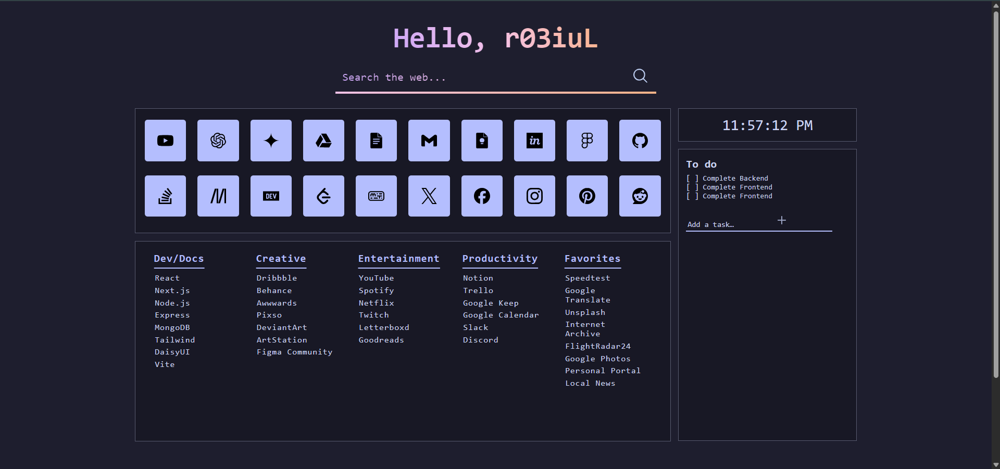

# 🌐 Origin - Personal Browser Homepage

**Origin** is a zero-dependency, offline-first start page powered by native **HTML**, **CSS**, and **JavaScript**. Built for **speed**, **focus**, and **accessibility**, it keeps your homepage **fast**, **local**, and **private**.

---

## ✨ Features

-   🧩 Responsive icon grid for quick links.
-   🌗 Light / dark theme support.
-   💾 Works fully offline — all assets local.

---

## 📁 Structure

```
origin-home/
├─ index.html
├─ css/
│  └─ style.css
├─ js/
│  └─ app.js
├─ assets/
│  ├─ icons/
│  │  ├─ github.svg
│  │  ├─ youtube.svg
│  │  └─ ...
│  ├─ fonts/
│  └─ images/
└─ README.md
```

---

## 🚀 Getting Started

1. **Clone or download** this repository:
    ```bash
    git clone https://github.com/<your-username>/origin-home.git
    ```
2. Open `index.html` directly in your browser.  
   (No server needed — it’s 100 % static.)
3. (Optional) Customize . 
4.  Set it as your browser **homepage** or **new tab** page:

   ### Google Chrome
   **To set as homepage:**
   1. Open **Settings → On startup**.  
   2. Select **Open a specific page or set of pages**.  
   3. Click **Add a new page** and paste the full file path to your `index.html`.  
      Example:  
      ```
      file:///C:/Users/YourName/Documents/origin-home/index.html
      ```
   4. Restart Chrome — it will open **Origin** on startup.

   **To set as new tab:**  
   Chrome doesn’t allow direct local files for new tabs. You can install the free extension **[New Tab Redirect](https://chrome.google.com/webstore/detail/new-tab-redirect/icpgjfneehieebagbmdbhnlpiopdcmna)** and set the redirect URL to your local file path (same as above).

   ---

   ### Mozilla Firefox
   **To set as homepage and new tab:**
   1. Open **Settings → Home**.  
   2. Under **Homepage and new windows**, choose **Custom URLs...**  
   3. Enter your local file path, for example:  
      ```
      file:///C:/Users/YourName/Documents/origin-home/index.html
      ```
   4. Under **New tabs**, select **Homepage**.  
   5. Close the tab — Firefox will now show **Origin** every time you open a new window or tab.


---

## ⚙️ Customization

-   Replace the imgs/icons inside `assets/` with your own
-   Update colors in `css/style.css` to match your theme

---

## 🧭 Roadmap

-   [ ] Editable tiles (drag, add, remove)
-   [ ] Local todo list
-   [ ] Background customization
-   [ ] And more.....

---

> “Simplicity is the ultimate sophistication.” — _Leonardo da Vinci_
